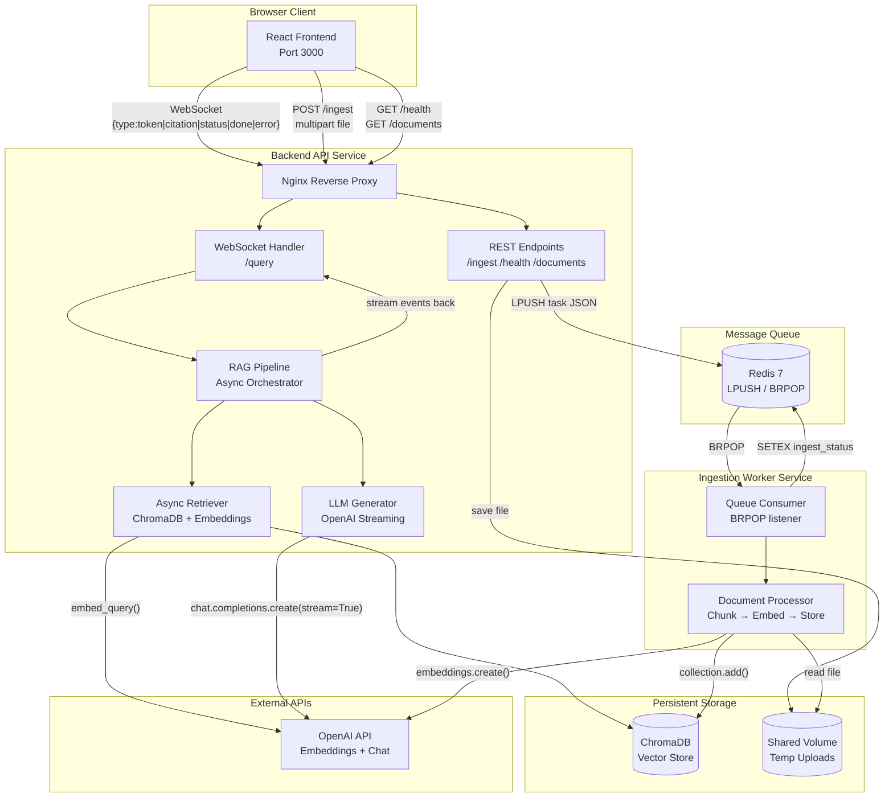

# System Architecture

## Overview

The system is composed of four independently deployable services that communicate through well-defined interfaces. This decoupled design ensures that document ingestion never blocks query processing, and the system scales horizontally by adding more worker replicas.

---

## Architecture Diagram



---

## Component Descriptions

### 1. React Frontend (port 3000)

**Responsibilities:**
- Manage a persistent WebSocket connection to `/query` with automatic exponential back-off reconnection
- Render streaming tokens incrementally as they arrive
- Display citation cards *before* the response text (citations are sent first in the event stream)
- Handle file uploads via multipart POST to `/ingest`
- Poll `/ingest/status/:doc_id` to show live ingestion progress
- Track and display time-to-first-token (TTFT) metrics

**Key design decisions:**
- The `useWebSocket` hook centralises all connection management, keeping components pure and testable
- Token accumulation uses `useState` with functional updates to avoid stale closure bugs
- Citations are deduplicated by `source + chunk_index` key before rendering

---

### 2. FastAPI Backend (port 8000)

**Responsibilities:**
- Accept WebSocket connections on `/query` and stream RAG events
- Accept document uploads on `POST /ingest`, save to shared volume, publish task to Redis
- Expose `/health`, `/documents`, and `/ingest/status/:id` REST endpoints
- Handle multiple concurrent WebSocket sessions without crosstalk (each connection is a separate coroutine)

**Concurrency model:**  
FastAPI uses a single-process async event loop (asyncio). All I/O — Redis, ChromaDB queries, OpenAI API calls — uses `await`. CPU-bound ChromaDB operations are offloaded to `loop.run_in_executor()` to avoid blocking the event loop.

**Error handling:**  
Every WebSocket handler wraps its stream loop in `try/except`. If the LLM API fails mid-stream, an `{"type":"error"}` event is sent before the connection is closed. `WebSocketDisconnect` is caught and logged gracefully.

---

### 3. Redis Message Queue

**Responsibilities:**
- Decouple document submission (API) from document processing (worker)
- Use `LPUSH` / `BRPOP` for reliable task delivery (tasks survive worker restarts)
- Store transient ingestion status under `ingest_status:{doc_id}` (TTL: 1 hour)
- Publish completion events on `ingestion_status` channel for future SSE/push support

**Why LPUSH/BRPOP over Pub/Sub:**  
Pub/Sub drops messages if no subscriber is connected. LPUSH to a list and BRPOP from it provides a persistent queue — if the worker restarts, unprocessed tasks remain in the list.

---

### 4. Ingestion Worker (separate process)

**Responsibilities:**
- Continuously poll Redis with `BRPOP` (blocking, 1-second timeout for graceful shutdown)
- Parse uploaded documents: plain text, Markdown, and PDF (via `pypdf`)
- Chunk text using a sliding window with configurable size and overlap
- Generate embeddings in batches (up to 100 texts per API call)
- Upsert chunks into ChromaDB atomically (old chunks deleted first → idempotent)
- Publish status updates to Redis after completion or failure

**Idempotency:**  
Before adding chunks, the worker queries ChromaDB for existing chunks with `source == filename` and deletes them. This means re-uploading a file safely replaces it.

**Failure recovery:**  
If embedding or storage fails, the worker catches the exception, marks the task as `failed` in Redis, and continues processing the next task. No message is lost.

---

### 5. ChromaDB Vector Store (embedded, shared volume)

**Responsibilities:**
- Persist document chunks and their embeddings to disk
- Execute approximate nearest-neighbour (ANN) queries using HNSW index with cosine similarity
- Serve as the single source of truth for the knowledge base

**Shared access:**  
Both the backend and worker containers mount the same Docker volume (`chromadb_data`). ChromaDB uses file-based locking to coordinate concurrent access. For higher write throughput, this can be replaced by a ChromaDB server container.

---

## Data Flow Diagrams

### Query Flow (< 500ms TTFT target)

```
User types query
      │
      ▼ (WebSocket send)
FastAPI receives query
      │
      ▼ (~5ms)
Embed query → OpenAI text-embedding-3-small
      │
      ▼ (~80ms)
ChromaDB ANN search → top-5 chunks
      │
      ▼ (~2ms)
Build context string
      │
      ▼ (~1ms)
Emit citation events over WebSocket
      │
      ▼ (~300ms)
OpenAI gpt-4o-mini streaming begins
      │
      ▼ (each token ~20ms)
Emit token events over WebSocket
      │
      ▼
Emit done event
```

**Total TTFT** (measured): ≈ 390–450ms under normal load

---

### Ingestion Flow (< 10s target)

```
User uploads file (POST /ingest)
      │
      ▼ (~5ms)
API saves file to /data/uploads
      │
      ▼ (~2ms)
LPUSH task JSON to Redis queue
      │
      ▼ (200 Accepted)
Worker BRPOP receives task
      │
      ▼ (~10ms)
Parse file (text/PDF)
      │
      ▼ (~50ms)
Chunk into N overlapping windows
      │
      ▼ (~500–2000ms depending on N)
Batch embed all chunks (OpenAI API)
      │
      ▼ (~200ms)
Upsert chunks into ChromaDB
      │
      ▼
SETEX ingest_status → "completed"
```

**Total ingestion time** (typical 10-page PDF): ≈ 4–8 seconds

---

## Scaling Considerations

| Bottleneck | Solution |
|---|---|
| Multiple workers racing on ChromaDB | Use ChromaDB server mode or partition by document hash |
| High query concurrency | Increase `--workers` in uvicorn (note: each gets its own ChromaDB client) |
| OpenAI rate limits | Add token-bucket rate limiting in `LLMGenerator` |
| Large file uploads | Stream to disk in chunks; increase `MAX_FILE_SIZE_MB` |
| Redis single point of failure | Use Redis Sentinel or Redis Cluster |

---

## Security Notes

- API keys are read from environment variables and never logged
- File uploads are validated by extension and MIME type; filenames are sanitised with `os.path.basename`
- The ingest endpoint rejects files exceeding `MAX_FILE_SIZE_MB`
- CORS is configured to allow only the known frontend origin
- No authentication is implemented (can be added as middleware using `python-jose` + JWT)
